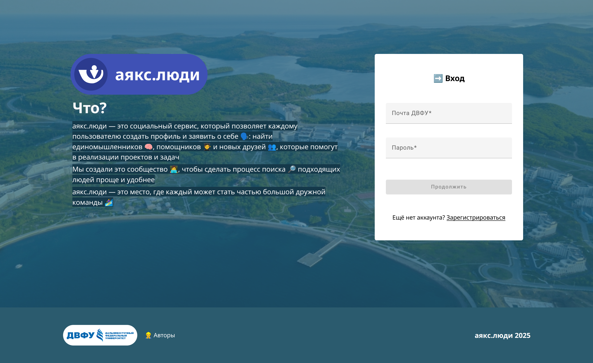
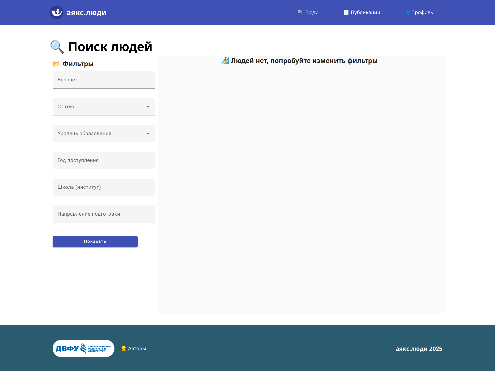
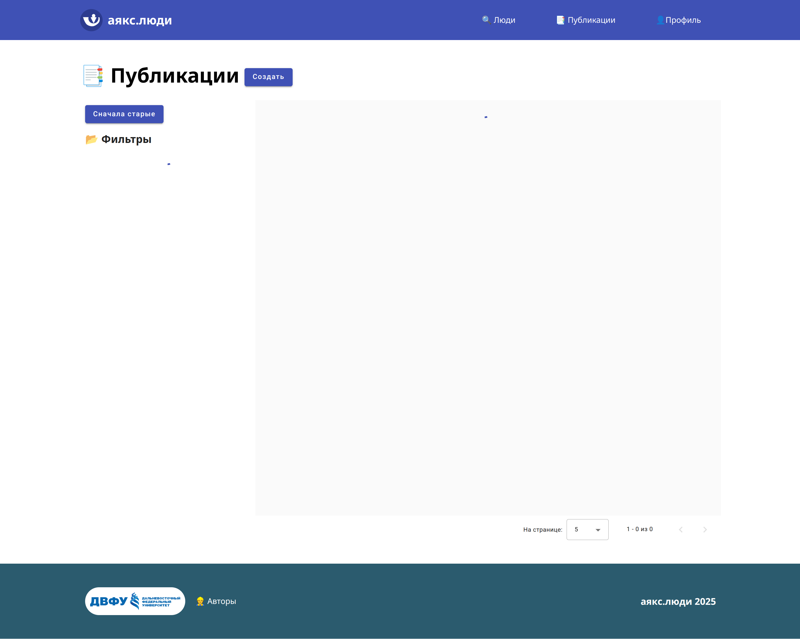

# ajax-people-frontend

### Description

A meeting service, the purpose of which is to connect people with each other by choosing common interests and publishing posts

### Key features
- register and verify your email
- all list of faculies and schools
- post your publications
- find people you are insterested in
- sort people by year of admission, school, interests, e.g...
- change your profile
- sort publications and find what you need

### Stack

angular + angular/material

### Serve

```bash
npm install
```
or
```bash
yarn install
``` 

```bash
ng serve
```

### Screenshots


*Fig 1. Home page*


*Fig 2. Sign up page*


*Fig 3. Users page*


*Fig 4. Posts page*